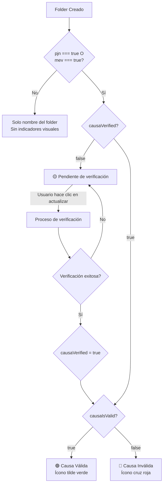

# 📁 Guía de Estados Visuales de Folders

## Descripción General

Este documento describe los diferentes estados visuales que puede tener un folder/causa en la tabla de la vista `/apps/folders/list` de Law Analytics. Estos estados indican el nivel de verificación y validación de cada expediente judicial en el sistema.

## ⚠️ Condición Principal para Mostrar Indicadores

**IMPORTANTE**: Los indicadores visuales de estado SOLO se mostrarán cuando:
- `pjn === true` (Folder vinculado al Poder Judicial de la Nación) **O**
- `mev === true` (Folder con Movimientos Electrónicos Verificados)

Si ambas propiedades son `false`, se mostrará únicamente el nombre del folder sin ningún indicador visual.

## 📊 Tabla de Estados Visuales

| **Indicador Visual** | **Descripción** | **Condición Previa** | **Condiciones de Estado** | **Tooltip/Mensaje** | **Acciones** |
|---------------------|-----------------|---------------------|--------------------------|---------------------|--------------|
| **Solo nombre del folder** | Sin vinculación judicial | `pjn = false`<br>`mev = false` | N/A | Ninguno | Ninguna |
| 🟢 **Ícono de tilde verde** (TickCircle) | Causa verificada y válida | `pjn = true` **O**<br>`mev = true` | `causaVerified = true`<br>**Y**<br>`causaIsValid = true` | • "Causa vinculada a PJN" (si `pjn = true`)<br>• "Causa vinculada" (si `pjn = false`) | Ninguna |
| 🟡 **Chip amarillo** "Pendiente de verificación" | Causa pendiente de verificar | `pjn = true` **O**<br>`mev = true` | `causaVerified = false` | "Actualizar estado de verificación" | Botón 🔄 |
| 🔴 **Ícono cruz roja** (CloseCircle) + **Chip rojo** "Causa inválida" | Causa verificada pero inválida | `pjn = true` **O**<br>`mev = true` | `causaVerified = true`<br>**Y**<br>`causaIsValid = false` | "Causa inválida - No se pudo verificar en el Poder Judicial" | Ninguna |
| 🟡 **Chip amarillo** "Pendiente" | Estado legacy para compatibilidad | `pjn = true` **O**<br>`mev = true` | `folderName = "Pendiente"` | "Actualizar estado de verificación" | Botón 🔄 |

### 📝 Notas sobre la tabla:
- **Condición Previa**: Debe cumplirse PRIMERO para que se evalúen las condiciones de estado
- **Condiciones de Estado**: Se evalúan SOLO si la condición previa es verdadera
- Los operadores lógicos son: **Y** (ambas condiciones deben ser verdaderas), **O** (al menos una debe ser verdadera)
- Si `pjn = false` Y `mev = false`, no se evalúan las condiciones de estado y solo se muestra el nombre

## 🔄 Diagrama de Flujo de Estados



## 📋 Propiedades del Sistema

### Propiedades Principales

- **`pjn`** (Boolean): Indica si la causa está vinculada al Poder Judicial de la Nación
- **`mev`** (Boolean): Indica si el folder tiene Movimientos Electrónicos Verificados
- **`causaVerified`** (Boolean): Indica si se ha intentado verificar la causa en el sistema judicial
- **`causaIsValid`** (Boolean): Indica si la causa es válida en el sistema judicial
- **`causaAssociationStatus`** (String): Estado de asociación (success, pending, failed)
- **`causaUpdateEnabled`** (Boolean): Indica si las actualizaciones automáticas están habilitadas

### Propiedades Relacionadas

- **`causaId`**: ID de la causa vinculada en el sistema judicial
- **`causaType`**: Tipo de causa (CausasCivil, CausasTrabajo, CausasSegSocial)
- **`folderName`**: Nombre/carátula del expediente (máximo 50 caracteres en vista)

## 🛠️ Implementación Técnica

### Ubicación del Código
- **Archivo principal**: `/src/pages/apps/folders/folders.tsx`
- **Líneas**: 689-804 (definición de la columna "Carátula")
- **Tipos**: `/src/types/folder.ts`

### Lógica de Visualización
```javascript
// Verificación principal antes de mostrar cualquier indicador
const showStatusIndicators = folder.pjn === true || folder.mev === true;

if (!showStatusIndicators) {
    // Si pjn y mev son false, solo mostrar el nombre
    return <span>{formatFolderName(value, 50)}</span>;
}

// Si pasa la verificación, aplicar la lógica de estados visuales
```

### Función de Actualización
Cuando el usuario hace clic en el botón de actualización (🔄):

```javascript
dispatch(getFolderById(folder._id, true))
```

Esta acción:
1. Consulta el estado actual del folder en la base de datos
2. Intenta verificar contra el sistema del Poder Judicial
3. Actualiza las propiedades `causaVerified` y `causaIsValid`
4. Refresca la vista de la tabla

### Campos Solicitados al Backend
Los campos específicos solicitados en las consultas son:
```
_id, folderName, status, materia, orderStatus,
initialDateFolder, finalDateFolder, folderJuris,
folderFuero, description, customerName, pjn,
causaVerified, causaIsValid, causaAssociationStatus
```

## 🎨 Aspectos Visuales

### Colores y Estilos
- **Verde (#22C55E)**: Causa válida y verificada
- **Amarillo (warning)**: Estado pendiente
- **Rojo (#EF4444)**: Causa inválida
- **Tamaño de íconos**: 16px
- **Tamaño de chips**: "small"
- **Variante de chips**: "light"

### Truncamiento de Texto
- Los nombres de folders se truncan a **50 caracteres** máximo
- Se usa la función `formatFolderName(value, 50)`

## 📌 Casos de Uso

### Caso 1: Folder sin vinculación judicial
1. Usuario crea un nuevo folder
2. No activa PJN ni MEV (`pjn === false` y `mev === false`)
3. Sistema muestra SOLO el nombre del folder
4. No hay indicadores visuales de estado

### Caso 2: Folder con vinculación pendiente
1. Usuario crea folder con PJN o MEV activado
2. Sistema muestra chip amarillo "Pendiente de verificación"
3. Usuario puede hacer clic en actualizar para verificar

### Caso 3: Verificación exitosa
1. Sistema verifica el expediente en el Poder Judicial
2. Expediente existe y es válido
3. Se muestra ícono de tilde verde
4. Solo visible si `pjn === true` o `mev === true`

### Caso 4: Verificación fallida
1. Sistema intenta verificar el expediente
2. Expediente no existe o datos no coinciden
3. Se muestra ícono de cruz roja con chip "Causa inválida"
4. Solo visible si `pjn === true` o `mev === true`

### Caso 5: Folder mixto
1. Folder tiene `pjn === false` pero `mev === true`
2. Se muestran los indicadores de estado
3. Permite verificación de movimientos electrónicos sin PJN

## 🔗 Proceso de Vinculación con el Poder Judicial

### Descripción General
Los usuarios pueden vincular sus folders/causas con el Poder Judicial de la Nación (PJN) para recibir actualizaciones automáticas y verificar el estado de sus expedientes.

### 🖥️ Interfaz de Vinculación

#### Modal "Vincular con Poder Judicial"

Cuando el usuario hace clic en "Vincular con Poder Judicial", se presenta un modal con dos opciones:

```
┌─────────────────────────────────────────────┐
│ 📄 Vincular con Poder Judicial              │
├─────────────────────────────────────────────┤
│                                             │
│ Seleccione el poder judicial:              │
│                                             │
│ ┌─────────────────────────────────────┐   │
│ │ ⚖️ Poder Judicial de la Nación      │   │
│ │   Vincule causas del fuero federal  │   │
│ └─────────────────────────────────────┘   │
│                                             │
│ ┌─────────────────────────────────────┐   │
│ │ 🏛️ Poder Judicial de Buenos Aires   │   │
│ │   [Próximamente]                    │   │
│ │   Vincule causas del fuero provincial│   │
│ └─────────────────────────────────────┘   │
│                                             │
│                      [Cancelar]             │
└─────────────────────────────────────────────┘
```

#### Formulario de Vinculación con PJN

Al seleccionar "Poder Judicial de la Nación", se muestra:

```
┌─────────────────────────────────────────────┐
│ 📄 Vincular con Poder Judicial de la Nación │
├─────────────────────────────────────────────┤
│                                             │
│ ┌─────────────────────────────────────┐   │
│ │      [Logo PJN en fondo #222E43]     │   │
│ └─────────────────────────────────────┘   │
│                                             │
│ Jurisdicción *                             │
│ ┌─────────────────────────────────────┐   │
│ │ Seleccione una jurisdicción     ▼   │   │
│ └─────────────────────────────────────┘   │
│                                             │
│ Número de Expediente *                     │
│ ┌─────────────────────────────────────┐   │
│ │ Ej: 12345                           │   │
│ └─────────────────────────────────────┘   │
│                                             │
│ Año del Expediente *                       │
│ ┌─────────────────────────────────────┐   │
│ │ Ej: 2024                            │   │
│ └─────────────────────────────────────┘   │
│                                             │
│ ☑ Sobrescribir datos locales con los      │
│   del Poder Judicial                       │
│                                             │
│            [Atrás]  [Vincular Causa]       │
└─────────────────────────────────────────────┘
```

### 📊 Estados Post-Vinculación

Una vez que el usuario completa el proceso de vinculación, el folder pasa por los siguientes estados:

#### 1️⃣ **Vinculación Iniciada**
```
Carátula: [Nombre del Expediente] 🟡 Pendiente de verificación [🔄]
```
- El sistema envía `pjn: true` al backend
- Se muestra chip amarillo mientras se verifica

#### 2️⃣ **Verificación Exitosa**
```
Carátula: [Nombre del Expediente] 🟢
```
- Tooltip: "Causa vinculada a PJN"
- El expediente fue encontrado y validado en el sistema judicial
- `causaVerified: true` y `causaIsValid: true`

#### 3️⃣ **Verificación Fallida**
```
Carátula: [Causa inválida] 🔴
```
- El expediente no pudo ser verificado en el PJN
- `causaVerified: true` pero `causaIsValid: false`
- Tooltip: "Causa inválida - No se pudo verificar en el Poder Judicial"

### 🔄 Actualización Manual

En cualquier momento, si el folder muestra "Pendiente de verificación", el usuario puede:

1. **Hacer clic en el botón de actualización (🔄)**
   - Intenta verificar nuevamente contra el PJN
   - Actualiza el estado según el resultado

### 📝 Datos Enviados al Vincular

Cuando se vincula una causa, se envían los siguientes datos:

| **Campo** | **Descripción** | **Ejemplo** |
|-----------|-----------------|-------------|
| `pjnCode` | Código de jurisdicción | "1" (Civil) |
| `number` | Número de expediente | "12345" |
| `year` | Año del expediente | "2024" |
| `overwrite` | Sobrescribir datos locales | true/false |
| `pjn` | Vinculado con PJN | **true** |

### ⚡ Creación Directa con Vinculación

Los usuarios también pueden crear un nuevo folder directamente vinculado al PJN:

1. En la pantalla de folders, hacer clic en "➕ Agregar Causa"
2. Seleccionar "Importar desde Poder Judicial"
3. Completar el formulario de vinculación
4. El sistema crea el folder ya vinculado con `pjn: true`

### 🎯 Beneficios de la Vinculación

- ✅ **Actualizaciones automáticas**: Recibe movimientos judiciales
- ✅ **Validación oficial**: Confirma que el expediente existe
- ✅ **Sincronización de datos**: Mantiene la información actualizada
- ✅ **Notificaciones**: Alertas de nuevos movimientos (si está habilitado)

### ⚠️ Notas Importantes

- Solo se muestran indicadores visuales si `pjn === true` o `mev === true`
- Los folders sin vinculación judicial solo muestran el nombre
- La verificación inicial puede tomar algunos segundos
- El estado "Pendiente" es temporal mientras se verifica

## 🔍 Consideraciones Adicionales

### Compatibilidad Legacy
El sistema mantiene compatibilidad con folders antiguos que tienen `folderName === "Pendiente"`. Estos se tratan como casos pendientes de verificación.

### Performance
- La verificación se realiza bajo demanda (no automática)
- El usuario debe iniciar manualmente el proceso de verificación
- Evita llamadas innecesarias al sistema judicial

### Accesibilidad
- Todos los íconos incluyen tooltips descriptivos
- Los colores siguen patrones de contraste accesibles
- Los estados son identificables sin depender solo del color

## 📅 Última Actualización

- **Fecha**: Enero 2025
- **Versión**: 3.0.0
- **Cambios principales**:
  - Agregada condición para mostrar indicadores solo cuando `pjn === true` o `mev === true`
  - Documentado el proceso completo de vinculación con el Poder Judicial
  - Agregadas visualizaciones de la interfaz de usuario
- **Autor**: Sistema Law Analytics

---

*Este documento es parte de la documentación técnica de Law Analytics y debe mantenerse actualizado con los cambios en el código.*