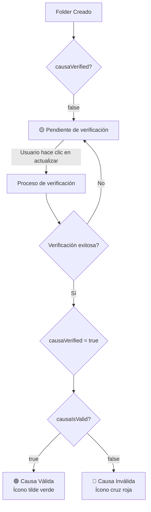

# 📁 Guía de Estados Visuales de Folders

## Descripción General

Este documento describe los diferentes estados visuales que puede tener un folder/causa en la tabla de la vista `/apps/folders/list` de Law Analytics. Estos estados indican el nivel de verificación y validación de cada expediente judicial en el sistema.

## 📊 Tabla de Estados Visuales

| **Indicador Visual** | **Descripción** | **Condiciones Técnicas** | **Tooltip/Mensaje** | **Acciones Disponibles** |
|---------------------|-----------------|--------------------------|---------------------|-------------------------|
| 🟢 **Ícono de tilde verde** (TickCircle) | Causa verificada y válida | `causaVerified === true` Y `causaIsValid === true` | • "Causa vinculada a PJN" (si `pjn === true`)<br>• "Causa vinculada" (si `pjn === false`) | Ninguna |
| 🟡 **Chip amarillo** "Pendiente de verificación" | Causa pendiente de verificar | `causaVerified === false` | "Actualizar estado de verificación" | Botón de actualización (🔄) |
| 🔴 **Ícono cruz roja** (CloseCircle) + **Chip rojo** "Causa inválida" | Causa verificada pero inválida | `causaVerified === true` Y `causaIsValid === false` | "Causa inválida - No se pudo verificar en el Poder Judicial" | Ninguna |
| 🟡 **Chip amarillo** "Pendiente" | Estado legacy para compatibilidad | `folderName === "Pendiente"` | "Actualizar estado de verificación" | Botón de actualización (🔄) |
| **Solo nombre del folder** | Estado por defecto | Ninguna condición anterior cumplida | Ninguno | Ninguna |

## 🔄 Diagrama de Flujo de Estados



## 📋 Propiedades del Sistema

### Propiedades Principales

- **`causaVerified`** (Boolean): Indica si se ha intentado verificar la causa en el sistema judicial
- **`causaIsValid`** (Boolean): Indica si la causa es válida en el sistema judicial
- **`pjn`** (Boolean): Indica si la causa está vinculada al Poder Judicial de la Nación
- **`causaAssociationStatus`** (String): Estado de asociación (success, pending, failed)
- **`causaUpdateEnabled`** (Boolean): Indica si las actualizaciones automáticas están habilitadas

### Propiedades Relacionadas

- **`causaId`**: ID de la causa vinculada en el sistema judicial
- **`causaType`**: Tipo de causa (CausasCivil, CausasTrabajo, CausasSegSocial)
- **`folderName`**: Nombre/carátula del expediente (máximo 50 caracteres en vista)

## 🛠️ Implementación Técnica

### Ubicación del Código
- **Archivo principal**: `/src/pages/apps/folders/folders.tsx`
- **Líneas**: 687-798 (definición de la columna "Carátula")
- **Tipos**: `/src/types/folder.ts`

### Función de Actualización
Cuando el usuario hace clic en el botón de actualización (🔄):

```javascript
dispatch(getFolderById(folder._id, true))
```

Esta acción:
1. Consulta el estado actual del folder en la base de datos
2. Intenta verificar contra el sistema del Poder Judicial
3. Actualiza las propiedades `causaVerified` y `causaIsValid`
4. Refresca la vista de la tabla

### Campos Solicitados al Backend
Los campos específicos solicitados en las consultas son:
```
_id, folderName, status, materia, orderStatus,
initialDateFolder, finalDateFolder, folderJuris,
folderFuero, description, customerName, pjn,
causaVerified, causaIsValid, causaAssociationStatus
```

## 🎨 Aspectos Visuales

### Colores y Estilos
- **Verde (#22C55E)**: Causa válida y verificada
- **Amarillo (warning)**: Estado pendiente
- **Rojo (#EF4444)**: Causa inválida
- **Tamaño de íconos**: 16px
- **Tamaño de chips**: "small"
- **Variante de chips**: "light"

### Truncamiento de Texto
- Los nombres de folders se truncan a **50 caracteres** máximo
- Se usa la función `formatFolderName(value, 50)`

## 📌 Casos de Uso

### Caso 1: Folder Nuevo
1. Usuario crea un nuevo folder
2. Sistema muestra chip amarillo "Pendiente de verificación"
3. Usuario puede hacer clic en actualizar para verificar

### Caso 2: Verificación Exitosa
1. Sistema verifica el expediente en el Poder Judicial
2. Expediente existe y es válido
3. Se muestra ícono de tilde verde

### Caso 3: Verificación Fallida
1. Sistema intenta verificar el expediente
2. Expediente no existe o datos no coinciden
3. Se muestra ícono de cruz roja con chip "Causa inválida"

## 🔍 Consideraciones Adicionales

### Compatibilidad Legacy
El sistema mantiene compatibilidad con folders antiguos que tienen `folderName === "Pendiente"`. Estos se tratan como casos pendientes de verificación.

### Performance
- La verificación se realiza bajo demanda (no automática)
- El usuario debe iniciar manualmente el proceso de verificación
- Evita llamadas innecesarias al sistema judicial

### Accesibilidad
- Todos los íconos incluyen tooltips descriptivos
- Los colores siguen patrones de contraste accesibles
- Los estados son identificables sin depender solo del color

## 📅 Última Actualización

- **Fecha**: Enero 2025
- **Versión**: 1.0.0
- **Autor**: Sistema Law Analytics

---

*Este documento es parte de la documentación técnica de Law Analytics y debe mantenerse actualizado con los cambios en el código.*