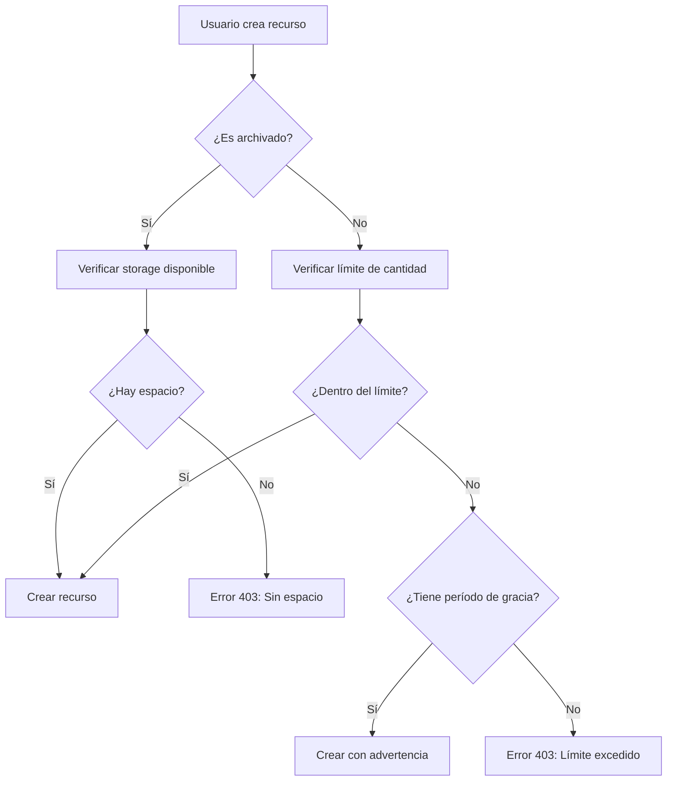

# Sistema de Storage y Límites de Recursos

## Índice
1. [Visión General](#visión-general)
2. [Límites por Plan](#límites-por-plan)
3. [Cálculo de Storage](#cálculo-de-storage)
4. [Sistema de Verificación](#sistema-de-verificación)
5. [Período de Gracia](#período-de-gracia)
6. [API Endpoints](#api-endpoints)
7. [Actualización de Storage](#actualización-de-storage)
8. [Mejores Prácticas](#mejores-prácticas)
9. [Troubleshooting](#troubleshooting)

## Visión General

El sistema de storage gestiona dos tipos de límites:
- **Límites de cantidad**: Para elementos activos (no archivados)
- **Límites de almacenamiento**: Para el total de datos (activos + archivados)

### Arquitectura

```
┌─────────────┐     ┌──────────────────┐     ┌─────────────┐
│   Cliente   │────▶│   Middleware     │────▶│  UserStats  │
│   (POST)    │     │ checkResourceLimits│     │  (MongoDB)  │
└─────────────┘     └──────────────────┘     └─────────────┘
                             │
                    ┌────────▼────────┐
                    │ storageService  │
                    └─────────────────┘
```

## Límites por Plan

### Plan FREE
```javascript
{
  folders: 5,          // Carpetas activas
  calculators: 3,      // Calculadoras activas
  contacts: 10,        // Contactos activos
  storage: 50          // MB totales (activos + archivados)
}
```

### Plan STANDARD
```javascript
{
  folders: 50,         // Carpetas activas
  calculators: 20,     // Calculadoras activas
  contacts: 100,       // Contactos activos
  storage: 1024        // MB totales (1 GB)
}
```

### Plan PREMIUM
```javascript
{
  folders: 500,        // Carpetas activas
  calculators: 200,    // Calculadoras activas
  contacts: 1000,      // Contactos activos
  storage: 10240       // MB totales (10 GB)
}
```

## Cálculo de Storage

### Tamaños Estimados por Tipo

| Tipo de Documento | Tamaño Estimado | Descripción |
|-------------------|-----------------|-------------|
| Contacto | 2 KB | Datos básicos del contacto |
| Carpeta | 10 KB | Carpeta con múltiples campos |
| Calculadora | 5 KB | Fórmulas y configuraciones |
| Archivo | Tamaño real | PDFs, imágenes, documentos |

### Fórmula de Cálculo

```javascript
Storage Total = (Contactos × 2KB) + (Carpetas × 10KB) + (Calculadoras × 5KB) + Archivos
```

### Ejemplo de Cálculo

Usuario con:
- 20 contactos = 20 × 2KB = 40KB
- 10 carpetas = 10 × 10KB = 100KB
- 5 calculadoras = 5 × 5KB = 25KB
- 2 PDFs de 500KB cada uno = 1000KB

**Total**: 1,165KB (~1.14 MB)

## Sistema de Verificación

### Flujo de Verificación



### Middleware de Verificación

```javascript
// Uso en rutas
router.post("/folders",
  authMiddleware,
  checkResourceLimits('folders'),
  createFolder
);
```

### Verificación para Elementos Archivados

Cuando `archived: true`:

1. **Calcula** el tamaño del nuevo documento
2. **Obtiene** el límite de storage del plan
3. **Verifica** disponibilidad
4. **Permite o bloquea** según el resultado

## Período de Gracia

### ¿Qué es?

Un período temporal donde se permiten operaciones aunque se excedan los límites del plan actual.

### Escenarios de Activación

1. **Downgrade de plan**: Usuario cambia de Premium a Standard
2. **Fallo de pago**: Problema con el método de pago
3. **Cancelación pendiente**: Plan cancelado pero aún activo

### Comportamiento

```javascript
if (!isWithinLimit && hasGracePeriod) {
  // Permitir operación
  // Agregar advertencia en respuesta
  response.gracePeriodWarning = {
    inGracePeriod: true,
    expiresAt: "2025-12-31T23:59:59Z",
    daysRemaining: 7,
    currentCount: 55,
    limit: 50
  }
}
```

## API Endpoints

### 1. Obtener Estado de Storage

```http
GET /api/user-stats/user
Authorization: Bearer {token}
```

**Respuesta**:
```json
{
  "success": true,
  "data": {
    "storage": {
      "total": 52428800,
      "contacts": 20480,
      "folders": 102400,
      "calculators": 25600,
      "files": 1024000,
      "fileCount": 2,
      "limit": 524288000,
      "limitMB": 500,
      "usedPercentage": 10
    },
    "planInfo": {
      "planId": "standard",
      "limits": {
        "folders": 50,
        "contacts": 100,
        "calculators": 20,
        "storage": 500
      }
    }
  }
}
```

### 2. Verificar Límite de Recurso Específico

```http
GET /api/plan-configs/check-resource/folders
Authorization: Bearer {token}
```

**Respuesta**:
```json
{
  "isWithinLimit": true,
  "currentCount": 45,
  "limit": 50,
  "plan": "standard",
  "percentageUsed": 90
}
```

### 3. Crear Recurso con Verificación

```http
POST /api/folders
Authorization: Bearer {token}
Content-Type: application/json

{
  "name": "Nueva Carpeta",
  "archived": false
}
```

**Respuestas Posibles**:

✅ **Éxito** (201):
```json
{
  "success": true,
  "folder": { ... }
}
```

❌ **Límite Excedido** (403):
```json
{
  "success": false,
  "message": "Has alcanzado el límite de carpetas para tu plan actual (standard)",
  "limitInfo": {
    "currentCount": 50,
    "limit": 50,
    "plan": "standard"
  }
}
```

⚠️ **Período de Gracia** (201):
```json
{
  "success": true,
  "folder": { ... },
  "warning": {
    "inGracePeriod": true,
    "message": "Estás en período de gracia. El límite se aplicará en 7 días"
  }
}
```

## Actualización de Storage

### Actualización Automática

Al crear/eliminar recursos:

```javascript
// services/storageService.js
updateStorageUsage(userId, 'folder', 1, document);  // Agregar
updateStorageUsage(userId, 'folder', -1, document); // Eliminar
```

### Recálculo Manual

Para sincronizar totales:

```javascript
// services/storageService.js
recalculateUserStorage(userId);
```

### Script de Mantenimiento

```bash
# Recalcular storage para todos los usuarios
node scripts/recalculateAllUsersStorage.js

# Recalcular para un usuario específico
node scripts/recalculateAllUsersStorage.js 6850300d153bccaac42b37db
```

## Mejores Prácticas

### 1. Optimización de Storage

- **Archivar** documentos antiguos en lugar de eliminarlos
- **Comprimir** archivos antes de subirlos
- **Limpiar** datos duplicados regularmente

### 2. Monitoreo

```javascript
// Verificar uso antes de operaciones masivas
const storageInfo = await storageService.getUserStorageInfo(userId);
if (storageInfo.usedMB > limitMB * 0.8) {
  // Advertir al usuario: 80% del límite usado
}
```

### 3. Manejo de Errores

```javascript
try {
  await createFolder(data);
} catch (error) {
  if (error.status === 403) {
    // Sugerir upgrade de plan
    showUpgradeDialog();
  }
}
```

### 4. Período de Gracia

- **Notificar** al usuario cuando entra en período de gracia
- **Mostrar** días restantes en el dashboard
- **Bloquear** operaciones críticas 24h antes del vencimiento

## Troubleshooting

### Problema: "Storage usado no coincide con realidad"

**Solución**:
```bash
# Recalcular storage del usuario
node scripts/recalculateUserStorage.js {userId}
```

### Problema: "Usuario no puede crear recursos aunque tiene espacio"

**Verificar**:
1. Límite de elementos activos vs archivados
2. Estado de la suscripción
3. Período de gracia expirado

```javascript
// Debug en consola
const subscription = await Subscription.findOne({ user: userId });
console.log('Plan:', subscription.plan);
console.log('Status:', subscription.status);
console.log('Grace Period:', subscription.downgradeGracePeriod);
```

### Problema: "Límites no se actualizan después de cambio de plan"

**Solución**:
```javascript
// Sincronizar con PlanConfig
await subscription.syncWithPlanConfig();
await subscription.save();
```

### Logs Útiles

```bash
# Ver logs de storage
grep "storage" logs/app.log | tail -50

# Ver verificaciones de límites
grep "checkResourceLimits" logs/app.log | tail -50

# Ver períodos de gracia
grep "gracePeriod" logs/app.log | tail -20
```

## Configuración de Límites

### Modificar Límites de un Plan

```javascript
// En MongoDB o mediante API
db.planconfigs.updateOne(
  { planId: "standard" },
  {
    $set: {
      "resourceLimits.$[elem].limit": 2048
    }
  },
  {
    arrayFilters: [{ "elem.name": "storage" }]
  }
)
```

### Aplicar Cambios a Suscripciones Existentes

```http
POST /api/plan-configs?updateSubscriptions=true
Authorization: Bearer {admin-token}
Content-Type: application/json

{
  "planId": "standard",
  "resourceLimits": [
    { "name": "storage", "limit": 2048 }
  ]
}
```

## Consideraciones de Rendimiento

### Índices Recomendados

```javascript
// En UserStats
db.userstats.createIndex({ userId: 1 });
db.userstats.createIndex({ "storage.total": 1 });

// En Subscriptions
db.subscriptions.createIndex({ user: 1, status: 1 });
```

### Caché de Límites

Los límites se cachean en memoria durante 5 minutos para evitar consultas repetidas:

```javascript
const cacheKey = `limits_${userId}`;
const cached = cache.get(cacheKey);
if (cached) return cached;
```

## Migración de Datos

### Al cambiar tamaños estimados

```javascript
// scripts/migrateStorageSizes.js
const NEW_SIZES = {
  contact: 3072,  // Nuevo tamaño
  folder: 15360,
  calculator: 7168
};

// Recalcular para todos los usuarios
await recalculateAllUsersStorage(NEW_SIZES);
```

## Webhooks y Eventos

### Eventos de Storage

```javascript
// Evento cuando se alcanza 80% del límite
EventEmitter.on('storage.warning', (userId, percentage) => {
  sendNotification(userId, `Has usado ${percentage}% de tu almacenamiento`);
});

// Evento cuando se excede el límite
EventEmitter.on('storage.exceeded', (userId) => {
  sendUpgradeEmail(userId);
});
```

## Roadmap Futuro

1. **Compresión automática** de documentos antiguos
2. **Storage en la nube** (S3) para archivos grandes
3. **Análisis de uso** con predicciones
4. **Alertas proactivas** antes de alcanzar límites
5. **Optimización automática** de documentos

---

*Última actualización: Diciembre 2024*
*Versión: 1.0.0*